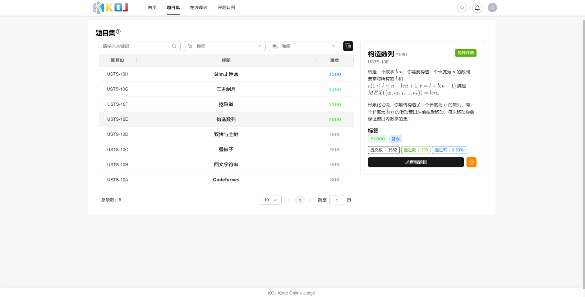
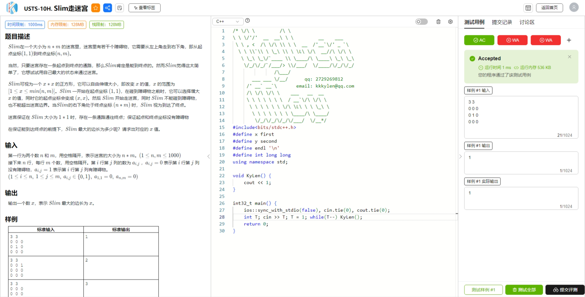
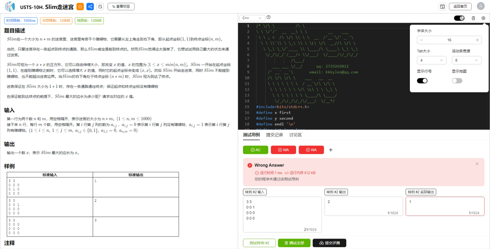
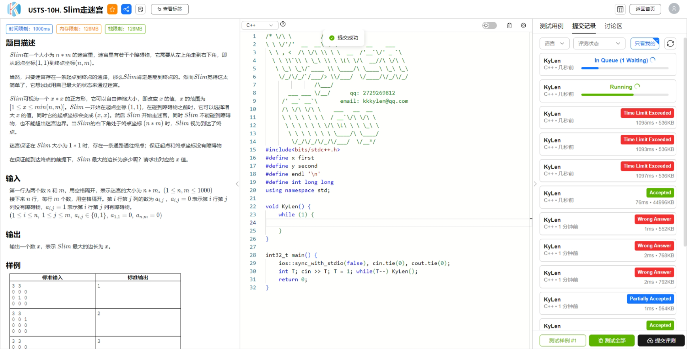
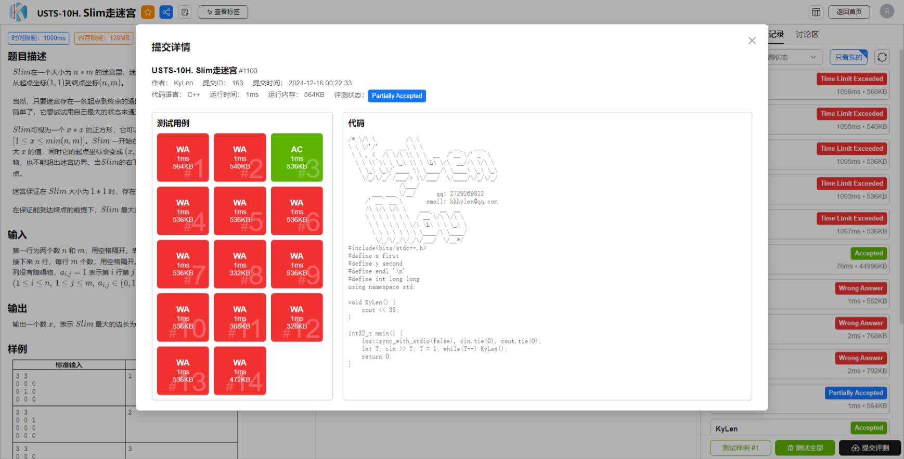

<h2 align="center">
KOJ - Kode Online Judge - 在线评测系统
</h2>

KOJ采用 <strong>SpringBoot + Vue 3</strong> 前后端分离架构，通过消息队列解耦提交与判题任务处理

KOJ前端采用 <strong><a href="https://github.com/opentiny/tiny-vue">TinyVue</a></strong> 组件库，提供简洁高效的用户界面

### 功能概览

- 完善的做题与调试体验：支持双布局做题界面，可同时调试多个测试用例并实时获取反馈
- 完善的提交与判题体验：提交后实时反馈评测状态，支持查看各个测试用例结果
- 安全的用户代码运行环境：使用go-judge安全代码沙箱隔离用户代码
- 可扩展的评测机调度：使用消息队列解耦用户提交与判题，实现评测机的可扩展性
- 完善的用户登录认证体验：支持用户名密码、邮箱、Github、QQ和微信多端注册与登录
- 待补充...

### 项目架构

待补充...

### 界面预览

- 题目集
  

- 做题界面（三列布局）
  

- 做题界面（传统布局+代码编辑器黑夜模式+代码编辑器设置）

  

- 提交列表
  

- 提交详情
  
