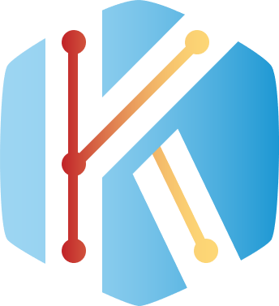

# KOJ - KCode Online Judge - 在线评测系统

## 技术选型

KOJ基于Springboot+Vue3前后端分离框架构建，数据库为Mysql，使用[go-judge](https://github.com/criyle/go-judge)作为安全的代码沙箱。作者热爱[Codeforces](https://codeforces.com/)，故前端自定义大量组件模仿并重构了其UI界面

| 后端技术                                       | 前端技术                             |
| ---------------------------------------------- | ------------------------------------ |
| 使用**Springboot**作为后端开发框架             | 使用**Vue3**作为前端开发框架         |
| 使用**Mybatis Plus**作为数据库操作框架         | 使用**Element Plus**作为主要UI框架   |
| 使用**Sa-Token**作为用户登录权限管理框架       | 使用**Monaco Editor**作为代码编辑器  |
| 使用**Redis**作为缓存中间件                    | 使用**Mavon Editor**作为富文本编辑器 |
| 使用**RabbitMQ**作为评测队列解耦提交与判题模块 | 使用**ECharts**作为数据可视化组件    |

